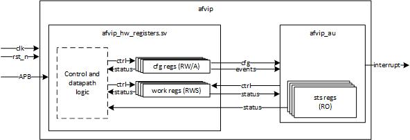
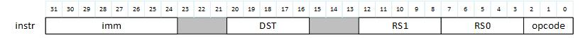

# Test Enviorment for ARM APB with a ALU(Arhitmetic Logic Unit)
This module implements an arithmetic unit configurable and controllable through APB interface. Supports only Addition and Multiplication operations.
Please see below the block diagram and interfaces:

*Block diagram of the system*
# Features
- Single clock domain (1Ghz)
- Support asynchronous reset active low

*Instruction format*

- Imm – Immediate value
- DST – Destination register address
- RS0 – Source register 0
- RS1 – Source register 1
- Opcode – Operation code
- The module supports the next operations according to the operation c ode:
- Opcode == 3’d0: reg[dst] = reg[rs0] + imm
- Opcode == 3’d1: reg[dst] = reg[rs0] * imm
- Opcode == 3’d2: reg[dst] = reg[rs0] + reg[rs1]
- Opcode == 3’d3: reg[dst] = reg[rs0] * reg[rs1]
- Opcode == 3’d4: reg[dst] = reg[rs0] * reg[rs1] + imm
 
## System Interface   
| Name     | Direction | Size     | Description |
| -------- | :--------: | -------- | ----------- |
| Clk      | I         | 1        | Clock     |
| rst_n    | I         | 1        | Asynchronous Reset active low      |
| afvip_intr  | O      | 1        | Interrupt   |

## APB Interface 
| Name     | Direction | Size     | Description |
| -------- | :--------: | -------- | -----------|
| psel      | I         | 1        | Select     |
| penable   | I         | 1        | Enable     |
| paddr     | I         | 16        | Addres     |
| pwrite    | I         | 1        | Direction     |
| pwdata    | I         | 32        | Write Data     |
| pready    | O         | 1        | Ready     |
| prdata    | O         | 32       | Read data     |
| pslverr   | O         | 1        | Transfer error     |
